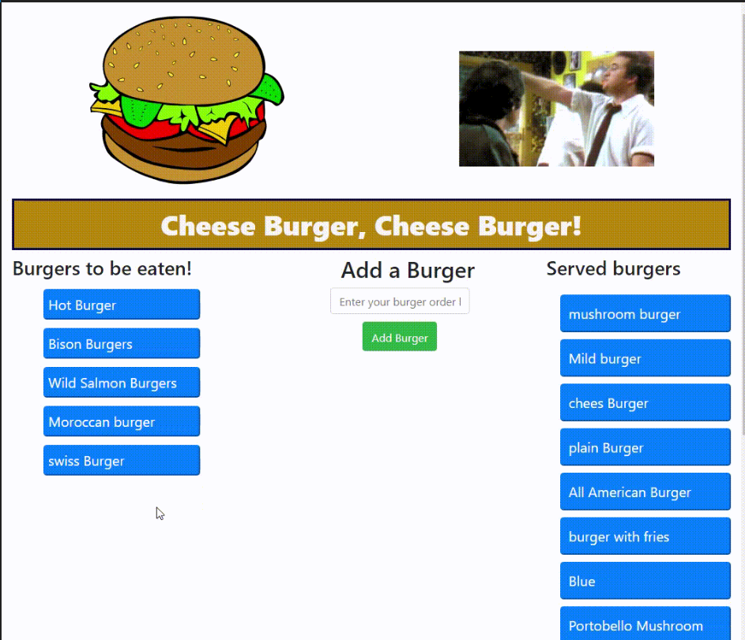

<!-- PROJECT LOGO -->
<br />
<p align="center">
  https://www.screencast.com/t/AxxW6rOTtcs
  <br />

  <h3 align="center">Note Taker</h3>

  <p align="center">
    <a href="https://github.com/mygithub23/burger"><strong>Explore the docs »</strong></a>
    <br />
    <br />
    <a href="https://www.screencast.com/t/AxxW6rOTtcs">View Demo</a>
 
    <a src="./Assets/img/burger.png">View Demo</a>
    ·
    <a href="">Report Bug</a>
    ·
    <a href="https://github.com/mygithub23/Note-Taker/issues">Request Feature</a>
  </p>
</p>

<!-- TABLE OF CONTENTS -->
<details open="open">
  <summary><h2 style="display: inline-block">Table of Contents</h2></summary>
  <ol>
    <li>
      <a href="#Screenshot">Screenshots</a>
      <ul>
        <li><a href="#Demo">Project Demo</a></li>
      </ul>
    </li>
    <li>
      <a href="#Short-Description">Project Objective</a>
      <ul>
        <li><a href="#Project-Description">Project Description</a></li>
      </ul>
    </li>
    <li>
      <a href="#getting-started">Getting Started</a>
      <ul>
        <li><a href="#prerequisites">Prerequisites</a></li>
        <li><a href="#Technologies">Technologies</a></li>
        <li><a href="#installation">Installation</a></li>
      </ul>
    </li>
    <li><a href="#usage">Usage</a></li>
    <li><a href="#How-to-test">How to Test</a></li>
    <li><a href="#license">License</a></li>
    <li><a href="#contact">Contact</a></li>
  </ol>
</details>

##Title

Note Taker

## Screenshots

 <p align="center">
    <a href="https://github.com/mygithub23/Employees-Management-System"><strong>Explore the docs »</strong></a>
  </p>
  <div>
    
  </div>
  <div>
    
</div>

### ✨Demo

Project Link: [https://github.com/mygithub23/burger](Burger)
<br>

<!-- ABOUT THE PROJECT -->

## Project Objective

cheese burger application will help customers to choose which buerger they like to eat. .

## Preject Description

The central feature that distinguishes the REST architectural style from other network-based styles is its emphasis on a uniform interface between components (Figure 5-6). By applying the software engineering principle of generality to the component interface, the overall system architecture is simplified and the visibility of interactions is improved. Implementations are decoupled from the services they provide, which encourages independent evolvability. The trade-off, though, is that a uniform interface degrades efficiency, since information is transferred in a standardized form rather than one which is specific to an application's needs. The REST interface is designed to be efficient for large-grain hypermedia data transfer, optimizing for the common case of the Web, but resulting in an interface that is not optimal for other forms of architectural interaction.

### Prerequisites

Need access to Internet to install all project dependencies.

## Technologies

Nodejs, Express, PostgreSQL and ejs

## Database
create table in PostgreSQL database

```
CREATE TABLE burger (
  id              SERIAL PRIMARY KEY,
  burger_name           VARCHAR(45) NOT NULL,
  status  boolean DEFAULT true
);


INSERT INTO burgers (burger_name) 
VALUES ('cheese Burger'), ('hot burger'), ('Swiss burger');

```

## Installation

on project root directory type 
```
$ npm install

$ npm start
```
## Usage

```
How to use the project - We can use Inquirer for this. The module includes a number of methods for various types of prompts, which are roughly analogous to HTML form controls. In order to collect the user’s GitHub username and password, we’re going to use the input and password types respectively.
```

## How to test

```
how to test the project - Require steps We can use Inquirer for this. The module includes a number of methods for various types of prompts, which are roughly analogous to HTML form controls. In order to collect the user’s GitHub username and password, we’re going to use the input and password types respectively.
```

<!-- LICENSE -->

## License

This project is [MIT](https://choosealicense.com/licenses/MIT/) licensed.<br />

Copyright © 2021 [Ali Alaoui}](https://github.com/mygithub23})

<!-- CONTACT -->

## Contact

Contact the author with any questions!<br>

- Twitter: [@myTwitterHandle](https://twitter.com/@myTwitterHandle)
- Github link: @[mygithub23](https://github.com/mygithub23)<br>
- Email: ali.alaoui@gmail.co
- heroku: https://notes-taker-manager.herokuapp.com/
- heroku git: https://git.heroku.com/notes-taker-manager.git
